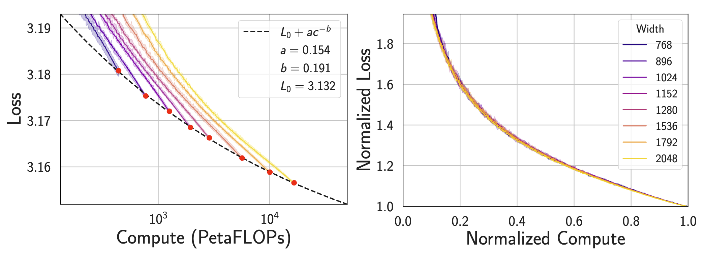

# Scaling Collapse Reveals Universal Dynamics in Compute-Optimally Trained Neural Networks

This repository contains the code for the paper [Scaling Collapse Reveals Universal Dynamics in Compute-Optimally Trained Neural Networks](https://arxiv.org/abs/2507.02119) by Shikai Qiu, Lechao Xiao, Andrew Gordon Wilson, Jeffrey Pennington, and Atish Agarwala.

<figure>
  
</figure>

In this work, we show
- Loss curves from compute-optimally trained models of varying sizes collapse onto a single universal curve when training compute and loss are normalized to unity at the end of training. 
- With learning rate decay, the collapse becomes so tight that differences in the normalized curves across models fall below the noise floor of individual loss curves across random seeds, a phenomenon we term **supercollapse**. We observe supercollapse across learning rate schedules, datasets, and architectures, including transformers trained on next-token prediction
- Supercollapse breaks down when hyperparameters are scaled suboptimally, providing a precise and practical indicator of good scaling. 
- We explain these phenomena based on neural scaling laws and a simple yet surprisingly effective model of SGD noise dynamics that accurately predicts loss curves across various learning rate schedules.

## ⚡ Quick Start

### Reproduce Figures (No Training Required)

You can run these notebooks to directly reproduce the main figures in the paper using our pre-computed training logs:

```bash
# Scaling law fitting and collapse visualization (Figure 1)
figures/collapse.ipynb

# Exact power-law analysis (Figure 5b)
figures/exact_power_laws.ipynb

# Learning rate schedule predictions (Figures 6 & 12)
figures/lr_schedules.ipynb
```

### Installation

```bash
# Install required packages (assuming CUDA 12)
pip install -U "jax[cuda12]"
pip install wandb hydra-core flax optax tqdm datasets matplotlib seaborn

# Log in to Weights & Biases
wandb login
```

## 📊 Reproducing Experiments

Our experiments use a lightweight JAX implementation forked from [picodo](https://github.com/martin-marek/picodo), supporting:
- $\mu\text{P}$ (maximal update parameterization) for transformers and MLPs
- Preconditioned gradient covariance trace logging for learning rate schedule analysis

### Supported Tasks

1. **MLP Regression on Power-Law Data**
   - Fastest experiment, minimal resource requirements
   - No dataset download needed
   - Synthetically generated regression data with power law scaling laws
   - **Recommended for quick validation**

2. **Transformer on Chess**
   - Medium complexity, reasonable training time
   - Chess move prediction task

3. **Transformer on CIFAR-5M**
   - Most computationally intensive
   - Autoregressive pixel modeling task

Using other datasets should be as straightforward as providing tokenized datasets in `your_ds/train.bin` and `your_ds/test.bin` and making a config under `configs` to specify the vocabulary size.

### Experiment Pipeline

#### Step 1: Dataset Preparation

```bash
# Download pre-tokenized datasets
sh download_cifar5m.sh
sh download_chess.sh

# Or prepare from scratch
python prepare_cifar5m.py    # Requires CIFAR-5M dataset at https://github.com/preetum/cifar5m
python prepare_chess.py      # Downloads Lichess data automatically from huggingface
```

#### Step 2: Fit Compute-Optimal Training Horizon

> **💡** You can skip this step and use our pre-fitted values in Step 3.

Run the appropriate wandb sweep:
```bash
# Define the sweep based on task
wandb sweep --project supercollapse experiments/mlp_fit.yaml
wandb sweep --project supercollapse experiments/chess_fit.yaml
wandb sweep --project supercollapse experiments/cifar5m_fit.yaml
# Launch the sweep (replace with your wandb username and the returned sweep id)
wandb agent <USERNAME>/supercollapse/<SWEEP_ID>
```

After completion, extract fitted data-compute scaling law parameters (`scale` and `exponent`) by running:
```bash
figures/fit_optimal_horizon.ipynb
```

#### Step 3: Generate Supercollapse with Learning Rate Decay
Run learning rate decay experiments with fitted compute-optimal horizon. Default `scale` and `exponent` values in these files use our fitted horizon, but you can replace with yours.
```bash
# Define the sweep based on task
wandb sweep --project supercollapse experiments/mlp.yaml
wandb sweep --project supercollapse experiments/chess.yaml
wandb sweep --project supercollapse experiments/cifar5m.yaml

# Launch the sweep (replace with your wandb username and the returned sweep id)
wandb agent <USERNAME>/supercollapse/<SWEEP_ID>
# Launch on multiple (e.g. 4) gpus
CUDA_VISIBLE_DEVICES=0,1,2,3 wandb agent <USERNAME>/supercollapse/<SWEEP_ID>
```

Save training logs and visualize:
```bash
# Update experiment name tag on line 123 first
python save_logs.py

# Visualize supercollapse
figures/collapse.ipynb
```

### Additional Experiments

#### Ablating $\mu\text{P}$
```bash
wandb sweep --project supercollapse experiments/mlp_no_mup.yaml
# Launch the sweep (replace with your wandb username and the returned sweep id)
wandb agent <USERNAME>/supercollapse/<SWEEP_ID>
```

#### Learning Rate Schedule Analysis
Run the following wandb sweeps (see launch command above):
```bash
# Figure 6 (CIFAR-5M schedules)
experiments/cifar5m_schedules_a.yaml  # Fig 6a
experiments/cifar5m_schedules_b.yaml  # Fig 6b
experiments/cifar5m_schedules_c.yaml  # Fig 6c

# Figure 12 (MLP schedules)
experiments/mlp_schedules_a.yaml      # Fig 12a
experiments/mlp_schedules_b.yaml      # Fig 12b
experiments/mlp_schedules_c.yaml      # Fig 12c
```

## 📝 Notes

- Fitting compute-optimal training horizon (step 2) is the most time-consuming step, requiring overtraining to identify the optimal frontier
- Where there are established data scaling laws (e.g., language modeling), you may want to skip Step 2 and use the known scaling
- If supercollapse isn't observed, check:
  - Data exponent fitting
  - Irreducible loss L₀ fitting
  - `opt.mup` ($\mu\text{P}$) is set to true (default)
  - Consider using more seeds or larger models for these fits to reduce the fit error
- As mentioned in the paper, the CIFAR-5M setup we provide here differs from the original setup used for the CIFAR-5M experiments in Figure 1, which was run in an older code base. Use the training logs provided in `logs/c5m.pkl` to reproduce Figure 1a & 1b exactly.
- By default, `config.seed` controls initialization only. Setting `config.shuffle` to true makes data ordering depend on seed too, which makes training slower but does not significantly change the results (e.g. supercollapse happens with or without seed-dependent data shuffling).

## 📚 Citation

```bibtex
@article{qiu2025scaling,
    title={{Scaling Collapse Reveals Universal Dynamics in Compute-Optimally Trained Neural Networks}},
    author={Shikai Qiu and Lechao Xiao and Andrew Gordon Wilson and Jeffrey Pennington and Atish Agarwala},
    journal={International Conference on Machine Learning (ICML)},
    year={2025}
}
```